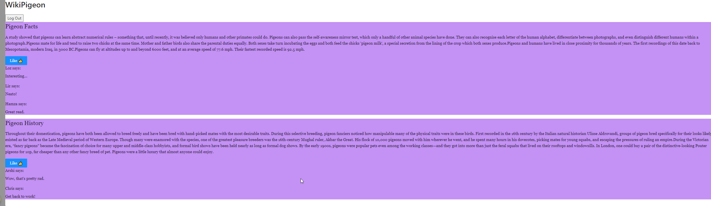

# Pigeon Articles

This app provides posts about pigeons with some comments added. You can also like the posts, and are required to log in to Auth0 to access the page.

## Screenshots



## Installation

Install my-project with npm

```bash
  npm install
  npm start
```

## Appendix

This project uses React.

## Deployment

To deploy this project run

```bash
  npm run build
```

## FAQ

#### Why is School of Code so obsessed with pigeons?

Read the page and you'll find out!

## 🚀 About Me

I'm training as a full stack developer on the School of Code bootcamp.

## Support

For support, email roberthuwjones@outlook.com

https://agitated-montalcini-3195fd.netlify.app
